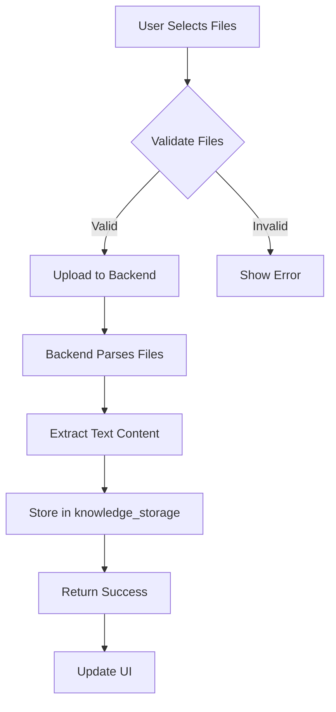
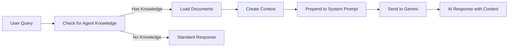

# 📚 Knowledge Upload Feature - Documentation

## Overview

The Knowledge Upload feature allows users to upload documents (PDF, TXT, DOCX) to give agents long-term memory and domain-specific knowledge. Uploaded documents are automatically parsed, stored, and integrated into agent responses.

---

## ✨ Features

### 1. **File Upload Support**
- **Supported Formats**: PDF, TXT, DOCX
- **Max File Size**: 10MB per file
- **Max Files**: 5 files per agent
- **Total Storage**: Up to 50MB per agent

### 2. **Automatic Text Extraction**
- **PDF**: Full text extraction using `pdfplumber`
- **DOCX**: Paragraph extraction using `python-docx`
- **TXT**: Direct UTF-8 text reading

### 3. **Intelligent Context Integration**
- Documents are automatically included in agent system prompts
- Content is formatted for optimal AI understanding
- Citations and references are preserved

### 4. **Knowledge Management**
- View all uploaded documents
- See file statistics (size, word count)
- Preview document content
- Delete individual files or entire knowledge base

---

## 🏗️ Architecture

### Backend Components

#### 1. File Parser (`backend/file_parser.py`)
```python
class FileParser:
    # File validation
    - validate_file()

    # Format-specific parsing
    - parse_txt()
    - parse_pdf()
    - parse_docx()

    # Text processing
    - chunk_text()
    - create_knowledge_context()
    - get_knowledge_summary()
```

**Key Features**:
- File size and type validation
- Multi-format support
- Text chunking for large documents
- Summary generation
- Context formatting for AI

#### 2. API Endpoints (`backend/app.py`)

| Endpoint | Method | Description |
|----------|--------|-------------|
| `/api/knowledge/upload` | POST | Upload files for an agent |
| `/api/knowledge/agents/<agent_id>` | GET | Get agent's knowledge base |
| `/api/knowledge/agents/<agent_id>` | DELETE | Delete all agent knowledge |
| `/api/knowledge/agents/<agent_id>/files/<file_id>` | DELETE | Delete specific file |

#### 3. Storage System

**Storage Location**: `backend/knowledge_storage/`

**File Structure**:
```
knowledge_storage/
└── {agent_id}.json
    ├── agent_id: string
    ├── created_at: timestamp
    ├── updated_at: timestamp
    └── documents: [
          {
            id: string (uuid)
            filename: string
            extension: string
            size: number
            word_count: number
            char_count: number
            summary: string (first 200 chars)
            content: string (full text)
            uploaded_at: timestamp
          }
        ]
```

### Frontend Components

#### 1. API Client (`api.ts`)
```typescript
class APIClient {
    // Upload files
    uploadKnowledge(agentId, files, onProgress?)

    // Get knowledge
    getAgentKnowledge(agentId)

    // Delete operations
    deleteAgentKnowledge(agentId)
    deleteKnowledgeFile(agentId, fileId)
}
```

#### 2. Knowledge Upload Component (`components/KnowledgeUpload.tsx`)

**Features**:
- File selection with validation
- Upload progress indication
- File list management
- Summary statistics display
- Error handling

**Props**:
```typescript
interface KnowledgeUploadProps {
  agentId: string;
  onKnowledgeUpdated?: () => void;
}
```

#### 3. Agent Builder Integration (`components/AgentBuilderWizard.tsx`)

**New Step**: "Knowledge Base / Memory Upload"
- Added as step 4 in the wizard
- Generates unique agent ID
- Manages knowledge state
- Optional but recommended

---

## 🔄 How It Works

### Upload Flow



### Agent Response Flow



---

## 💻 Usage

### Backend Setup

1. **Install Dependencies**:
```bash
pip install -r backend/requirements.txt
```

This installs:
- `pdfplumber==0.11.0` - PDF parsing
- `python-docx==1.1.0` - DOCX parsing

2. **Storage Directory**:
The `backend/knowledge_storage/` directory is automatically created on first run.

### Frontend Usage

#### In Agent Builder Wizard

1. Navigate to "Agent Studio"
2. Go through the wizard steps
3. **Step 4: Knowledge Base / Memory Upload**
   - Click "Select Files"
   - Choose PDF, TXT, or DOCX files
   - Click "Upload"
   - Wait for processing
4. Continue to next steps

#### Via API Client

```typescript
import { apiClient } from './api';

// Upload files
const files = [pdfFile, txtFile, docxFile];
const response = await apiClient.uploadKnowledge('agent_123', files);

// Get agent knowledge
const knowledge = await apiClient.getAgentKnowledge('agent_123');

// Delete file
await apiClient.deleteKnowledgeFile('agent_123', 'file_id_456');

// Delete all knowledge
await apiClient.deleteAgentKnowledge('agent_123');
```

---

## 🔒 Security Considerations

### File Upload Security

1. **File Type Validation**:
   - Only PDF, TXT, DOCX allowed
   - Extension and content-type checking

2. **Size Limits**:
   - 10MB per file
   - 50MB total per agent
   - 5 files maximum per agent

3. **Content Sanitization**:
   - Text encoding validation (UTF-8)
   - Error handling for malformed files
   - Content preview truncation

### Storage Security

1. **Isolated Storage**:
   - Each agent has separate storage
   - Knowledge files are gitignored
   - No cross-agent access

2. **Data Privacy**:
   - Uploaded content stored server-side only
   - Not transmitted to frontend except previews
   - Can be deleted by user

### Rate Limiting

| Endpoint | Limit |
|----------|-------|
| Upload | 20 per hour |
| Get Knowledge | 100 per hour |
| Delete Knowledge | 20 per hour |
| Delete File | 50 per hour |

---

## 📊 API Reference

### POST `/api/knowledge/upload`

**Upload files as agent knowledge**

**Request**:
- Content-Type: `multipart/form-data`
- Body:
  - `agent_id` (form field): Agent ID
  - `files` (file field, multiple): Files to upload

**Response**:
```json
{
  "success": true,
  "agent_id": "agent_123",
  "processed_files": [
    {
      "id": "uuid-1",
      "filename": "manual.pdf",
      "size": 1024000,
      "word_count": 5000
    }
  ],
  "total_files": 1
}
```

**Error Response**:
```json
{
  "error": "Error message",
  "details": "Additional details"
}
```

### GET `/api/knowledge/agents/<agent_id>`

**Get agent's knowledge base**

**Response**:
```json
{
  "agent_id": "agent_123",
  "knowledge": {
    "agent_id": "agent_123",
    "documents": [...],
    "created_at": "2025-01-10T00:00:00",
    "updated_at": "2025-01-10T01:00:00"
  },
  "summary": {
    "total_files": 2,
    "total_size": 2048000,
    "total_words": 10000,
    "file_types": {
      ".pdf": 1,
      ".txt": 1
    },
    "files": [...]
  }
}
```

### DELETE `/api/knowledge/agents/<agent_id>`

**Delete all knowledge for an agent**

**Response**:
```json
{
  "success": true,
  "message": "Deleted all knowledge for agent agent_123"
}
```

### DELETE `/api/knowledge/agents/<agent_id>/files/<file_id>`

**Delete a specific file**

**Response**:
```json
{
  "success": true,
  "message": "File deleted successfully",
  "remaining_files": 1
}
```

---

## 🧪 Testing

### Manual Testing Steps

1. **File Upload Test**:
   ```bash
   # Terminal 1: Start backend
   source venv/bin/activate
   cd backend && python app.py

   # Terminal 2: Start frontend
   npm run dev

   # Browser:
   # 1. Navigate to Agent Studio
   # 2. Go to Knowledge Upload step
   # 3. Upload test files (PDF, TXT, DOCX)
   # 4. Verify upload success
   # 5. Check file list displays correctly
   ```

2. **Knowledge Integration Test**:
   ```bash
   # 1. Upload a document with specific information
   # 2. Go to test panel
   # 3. Ask questions about the uploaded content
   # 4. Verify agent references the document
   ```

3. **File Management Test**:
   ```bash
   # 1. Upload multiple files
   # 2. Delete one file
   # 3. Verify file removed from list
   # 4. Delete all knowledge
   # 5. Verify knowledge base is empty
   ```

### API Testing

```bash
# Health check
curl http://localhost:8080/api/health

# Upload file
curl -X POST http://localhost:8080/api/knowledge/upload \
  -F "agent_id=test_agent" \
  -F "files=@test.pdf" \
  -F "files=@test.txt"

# Get knowledge
curl http://localhost:8080/api/knowledge/agents/test_agent

# Delete file
curl -X DELETE http://localhost:8080/api/knowledge/agents/test_agent/files/{file_id}

# Delete all
curl -X DELETE http://localhost:8080/api/knowledge/agents/test_agent
```

---

## 🚀 Deployment

### Production Considerations

1. **Storage**:
   - Ensure `backend/knowledge_storage/` has write permissions
   - Consider using cloud storage (S3, GCS) for scalability
   - Implement backup strategy

2. **Performance**:
   - Large files take time to parse
   - Consider async processing for > 5MB files
   - Cache parsed content for frequently accessed agents

3. **Monitoring**:
   - Log upload failures
   - Monitor storage usage
   - Track API usage per agent

4. **Cleanup**:
   - Implement retention policy
   - Delete knowledge when agent is deleted
   - Regular storage cleanup

### Environment Variables

No new environment variables needed. Uses existing configuration.

---

## 🔮 Future Enhancements

### Planned Features

1. **Vector Embeddings**:
   - Generate embeddings for uploaded content
   - Semantic search within knowledge base
   - RAG (Retrieval-Augmented Generation)

2. **Advanced Parsing**:
   - OCR for scanned PDFs
   - Table extraction
   - Image description

3. **Knowledge Management**:
   - Tag documents by topic
   - Document versioning
   - Knowledge base templates

4. **Collaboration**:
   - Share knowledge bases between agents
   - Import/export knowledge
   - Knowledge base marketplace

5. **Analytics**:
   - Track which documents are referenced
   - Usage statistics
   - Knowledge effectiveness metrics

---

## 📝 Changelog

### Version 1.0.0 (2025-01-10)

**Added**:
- File upload support (PDF, TXT, DOCX)
- Automatic text extraction
- Knowledge storage system
- API endpoints for knowledge management
- Frontend Knowledge Upload component
- Agent Builder Wizard integration
- File management (delete individual files)
- Summary statistics display
- Rate limiting for uploads

---

## 🤝 Contributing

When extending the knowledge upload feature:

1. **Add New File Types**:
   - Update `FileParser.SUPPORTED_EXTENSIONS`
   - Implement parsing method in `file_parser.py`
   - Update frontend validation in `KnowledgeUpload.tsx`

2. **Improve Text Extraction**:
   - Enhance chunking algorithm
   - Add table/image handling
   - Improve context formatting

3. **Storage Backend**:
   - Replace file storage with database
   - Implement S3/GCS integration
   - Add caching layer

---

## 📚 Resources

- **pdfplumber**: https://github.com/jsvine/pdfplumber
- **python-docx**: https://python-docx.readthedocs.io/
- **Gemini API**: https://ai.google.dev/docs
- **RAG Overview**: https://www.anthropic.com/index/contextual-retrieval

---

**Questions or Issues?**
- Check the troubleshooting section in DEPLOYMENT.md
- Review API error messages in browser console
- Check backend logs in `maher_ai.log`
